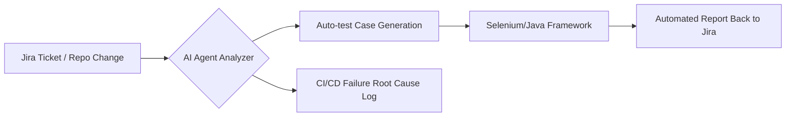



  <h1 align="center">Hi, I'm Barış 👋</h1>
  <h3 align="center">Senior Test Automation Engineer | Java + API Specialist | CI/CD + AI-Enhanced QA</h3>

---

## 👨‍💻 About Me

- 💼 Working as a **Senior Test Automation Engineer** at **Mercedes-Benz**  
- ⚙️ Specializing in Java-based backend testing, API validation, and CI-integrated frameworks  
- 🤖 Building reusable **AI agents** to automate Jira, Confluence, and CI flows  
- 📈 Passionate about scalable automation, traceability, and developer experience  
- 🌍 Collaborated with Mercedes-Benz, Garanti BBVA, and Turkcell  
- 🚀 I love clean systems, clean code, and meaningful automation

---

## 🛠️ Tech Stack

  

---

## 🤖 AI-Enhanced QA Agent Workflow

---

## 📮 Connect with Me

  
  

  

---

_Thanks for visiting my GitHub profile!_ 
<!-- Pairing with AI for achievement -->
